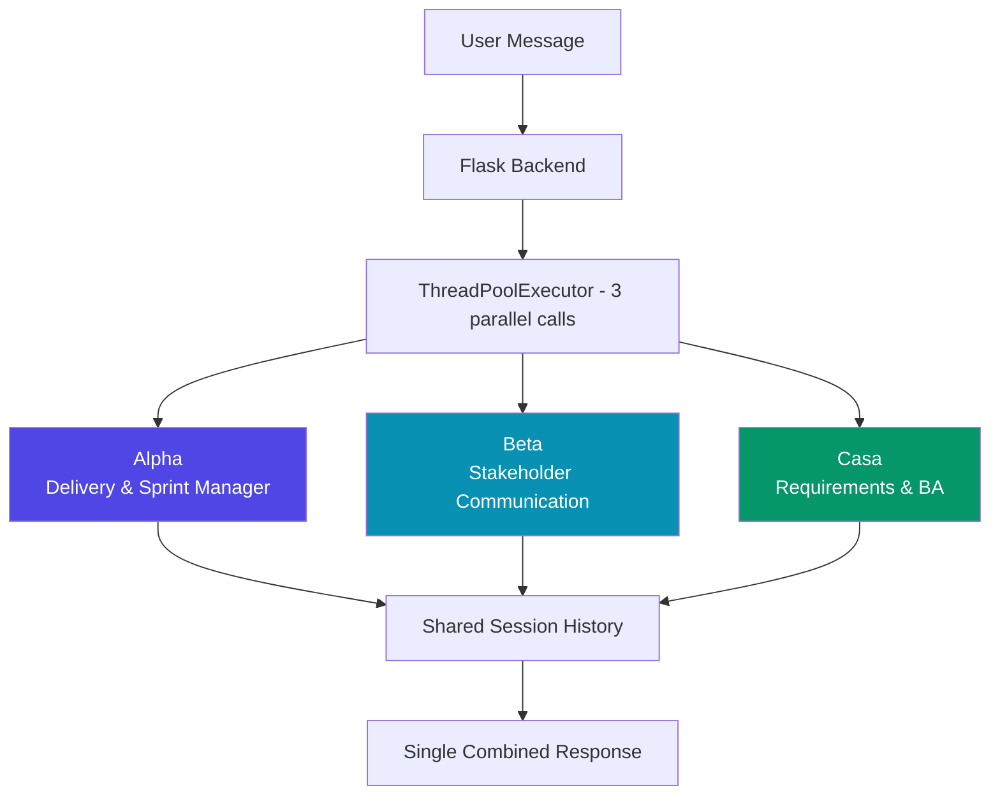
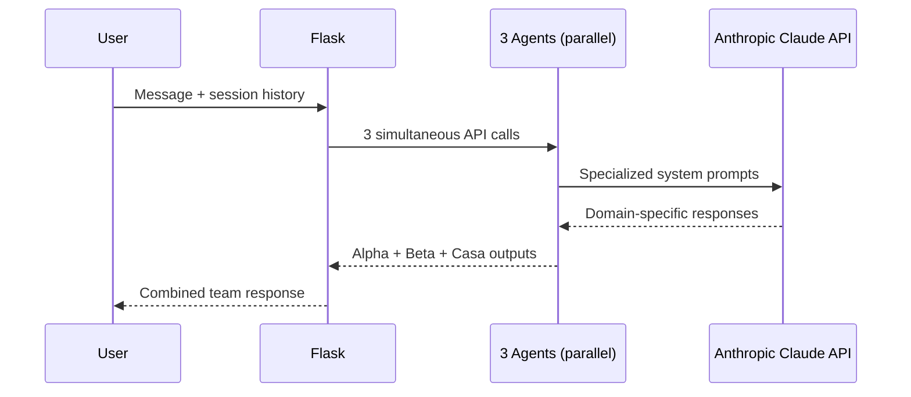
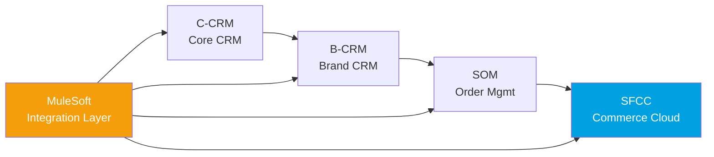

# Ashish Choudhary

### I build AI systems that automate enterprise program delivery.

*Senior Delivery Manager · Technical Program Manager · GenAI Builder*

---

## Who I Am

TPM with **5+ years** delivering **$1M–$5M enterprise programs** — Salesforce CRM, Commerce Cloud, Order-to-Cash.

The difference: I also **build the AI systems** that run those programs.

> Currently leading a **31-brand CRM migration** at Forsys Inc., managing 30+ engineers across Sales Cloud, Revenue Cloud, CPQ, CLM, and MuleSoft integrations.

---

## Start Here → Flagship Project

### [PM-Agents](https://github.com/ashishchoudhary7722-ctrl/Git/tree/master/pm-agents) — Multi-Agent AI System for TPM Automation

> **The problem:** TPMs spend 60–70% of their time on documents, status updates, and planning artifacts that follow predictable patterns.
> **My solution:** 3 specialized AI agents that automate all of it.

**Agent Architecture:**

**Impact:**
- `60–70%` reduction in TPM documentation time
- L3/L4 breakdown, PRDs, RAID logs, sprint readiness — on demand
- Deployed on a live $5M+ Salesforce enterprise program

**Stack:** `Python` · `Flask` · `Anthropic Claude` · `ThreadPoolExecutor` · `Vanilla JS`

---

## How I Think About Systems

**LLM Orchestration (PM-Agents):**

**Enterprise Delivery Flow (what I manage):**

---

## Other Projects

### [Job Agent](https://github.com/ashishchoudhary7722-ctrl/Git/tree/master/job-agent) — Automated Job Outreach Pipeline

- End-to-end automation: searches, applies, and sends referral messages on LinkedIn + Naukri
- Attaches CV automatically — zero stored credentials (uses Chrome remote debugging)

`Python` · `Selenium` · `Chrome Remote Debugging`

---

## Tech Stack

**AI / LLM**

**Enterprise Systems**

**Engineering**

**Program Management**

---

## Proof of Impact

| Program | Scale | Outcome |
|---|---|---|
| CRM Migration | 31 brands · 7M alumni | Multi-track delivery in progress |
| Salesforce Build | Sales Cloud + Revenue Cloud + CPQ | Zero production incidents |
| PM-Agents | Internal AI tooling | 60–70% TPM overhead cut |
| Capgemini PMO | €1.5M project · Heathrow + Coca-Cola | €30K/month savings · 10% efficiency gain |

---

## Certifications

---

## GitHub Stats

---

**Open to Senior TPM · Program Manager (AI) · Delivery Manager roles**

*"I don't just manage programs. I build the systems that run them."*

